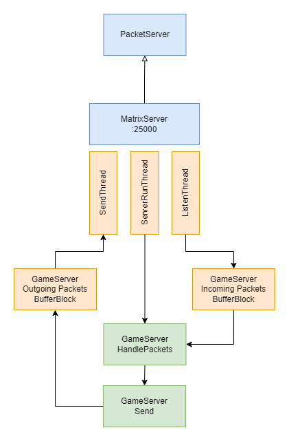
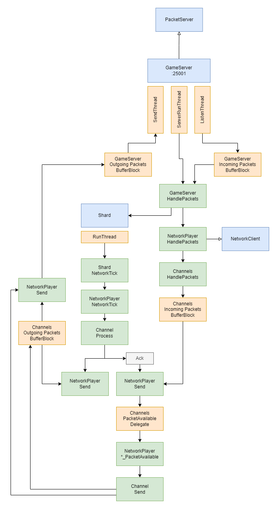

# Pirate Intelligence Network - Documention

PIN is split into two areas:
- [UdpHosts](#udphosts)
- [WebHosts](#webhosts)

## UdpHosts

As the name suggests these are the server hosts that talk via UDP to the client.
They are further more split into two servers:
- [MatrixServer](#matrixserver)
- [GameServer](#gameserver)

### MatrixServer

The MatrixServer handles the whole initial connection of a new client and tells it where to find the GameServer to connect to.
The handshake protocol is quite simple and as such the server setup is also rather basic.

### GameServer

The GameServer is really the heart of the whole operation, which handles player connections, active shaders and receives and sends packets in the Game Server Socket (GSS) protocol.

The GameServer runs three different threads:
- ListenThread
- ServerRunThread
- SendThread

Packets are fetch from the network socket in the `ListenThread` and pushed to a `BufferBlock` of incoming packets.
The `ServerRunThread` is responsible to picking the latest packet on the `BufferBlock` and start handling it.
The `SendThread` reads from a separate `BufferBlock` of outgoing packets and pushes them onto the network socket.

Each connecting client is migrated into a `Shard`, which has its own `RunThread` that triggers a timed network tick, which then causes the queued packets to be sent and pending packets to be proccessed.

The GSS protocol has four different channels:
- Control - Connection and time sync handling
- Matrix - Shard / zone related events and commands
- Reliable GSS - Message delivery is ensured with resend functionality
- Unreliable GSS - Message delivery is not guaranteed

The `NetworkClient` (`NetworkPlayer` as concrete implementation) subscribes via delegate onto the different channels and during the `Shard` network tick, the channel processing triggers these delegates.

### References

- [Game Server Protocol Overview](https://github.com/themeldingwars/Documentation/wiki/Game-Server-Protocol-Overview)
- [AeroMessages](https://github.com/themeldingwars/AeroMessages)

## WebHosts

Firefall uses a selection of different HTTP-based web hosts for various functionalities.
PIN implements some of those end points and has split them into the following projects:
- WebHost.CatchAll - Fallback for any unimplemented endpoint
- WebHost.Chat - API for handling the various chat channels
- WebHost.ClientApi - Primary API for characters, armies, social features, etc.
- WebHost.InGameApi - Secondary API for more bulkier data and game client information
- WebHost.Market - API for handling marketplace information
- WebHost.OperatorApi - Basic operation info, such as current API versions
- WebHost.Replay - Handling of replay actions
- WebHost.Store - RedBean store information
- WebHost.WebAsset - Assets of all sorts, from icons, to JavaScript, to streamed audio or textures

### References

- [OpenAPI Specification](https://github.com/themeldingwars/Documentation/tree/master/Networking)
- [Game Hosts - FireFall Wiki](https://firefall-archive.fandom.com/wiki/Game_Hosts)